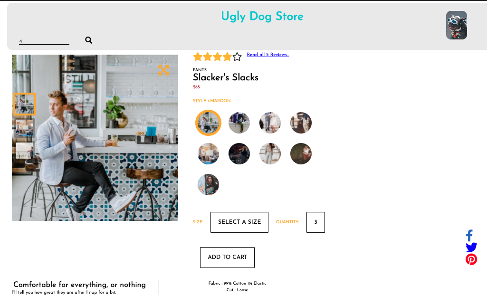
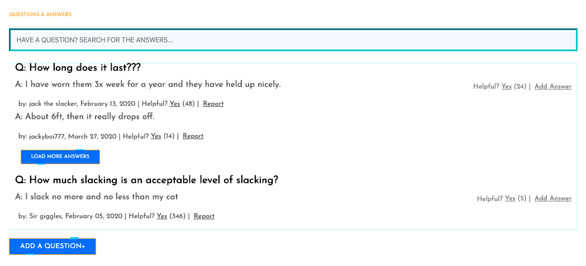
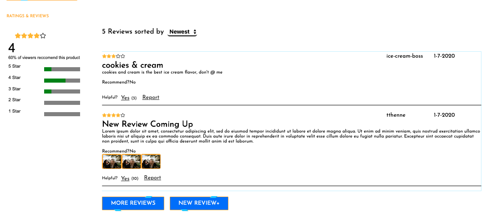

# The Ugly Dog Store

The Ugly Dog Store is a redesign of an outdated E-Commerce site.

# Description

This greenfield project was created using Agile methods (Git Feature Branch Workflow) and adhered to a wireframe. Each module (Product Overview, Questions and Answers, Ratings and Reviews) was worked on independently. The three engineers who created each module for this project worked seamlessly in setting up the developer environment and collaborating on various UI/UX features.

## Built With

React,
Babel,
Webpack,
Sass,
@babel,
Jest,
Enzyme,
CircleCI,
Surge

# Installation

In order to install the applications dependencies, in the terminal, run the following command:

`npm install`

To start running the live server run:

`npm start`

To start webpack run:

`npm run react-dev`

Alternatively one could run:

`npm run dev:start`

## Authors

[Rob Gonzalez-Pita](http://robpita.com) - personal site

[Savi Williams](https://github.com/savi1623) -github profile

[Palmi Moeller](https://github.com/Palmipalooza) - github profile
